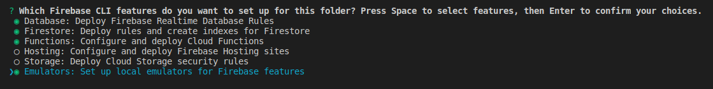
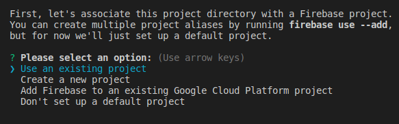

# Paytm All-in-One SDK Sample (Server Side)

This repo consists of server side code for using [Paytm All-in-One SDK](https://developer.paytm.com/docs/all-in-one-sdk/) implemented using Firebase functions. The Android sample project can be found at [PaytmIntegrationSample](https://github.com/Parthav46/PaytmIntegrationSample).

## Prerequisits:
1. [Firebase CLI](https://firebase.google.com/docs/cli)
2. Obtain Paytm Merchant credentials from https://dashboard.paytm.com/next/apikeys
3. Have a [Blaze Plan](https://firebase.google.com/pricing) subscription for your firebase project (For using Firebase Functions with Node.js 10 runtime)

## Setup:

- Download the repo zip
- Run `firebase init` in the extracted repo and select the following features
    - Database
    - Firestore
    - Functions
    - Emulator (optional)

- Select the existing firebase project with Blaze Plan  

- Setup Paytm merchant keys in Firebase functions config  
    `firebase functions:config:set paytm.mid="your-mid"`  
    `firebase functions:config:set paytm.key="your-key"`  
    `firebase functions:config:set paytm.website="WEBSTAGING"`

## Contributing Guidelines:
- Fork the repo to your account and then clone it on your machine
- Make a separate branch for the changes you make with a meaningful name
- Commit your changes to the branch
- Make a Pull Request to [master](../../tree/master) with PR body containing description of changes you made and link to its issue.
